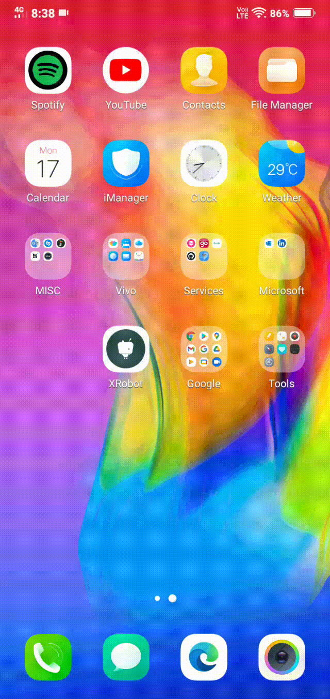
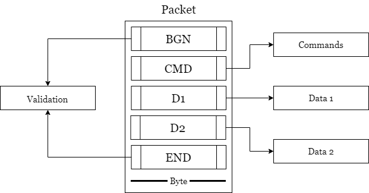
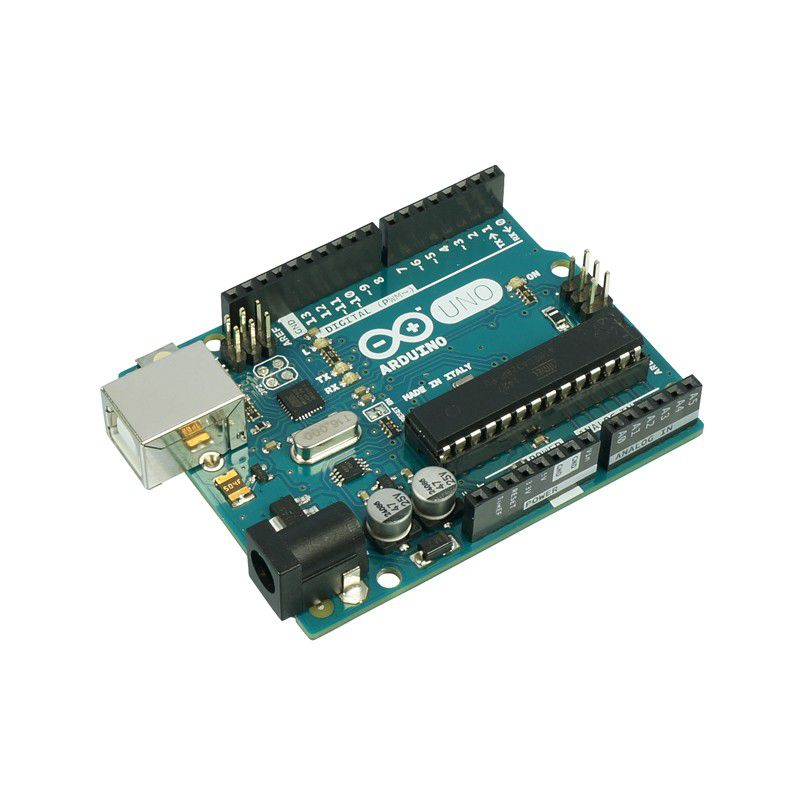
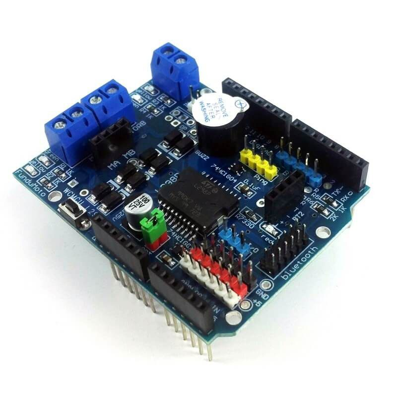
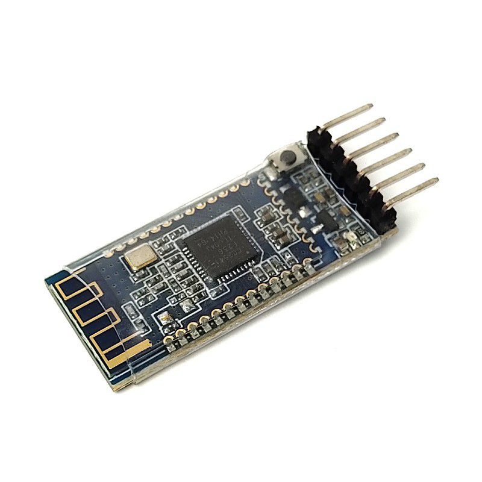
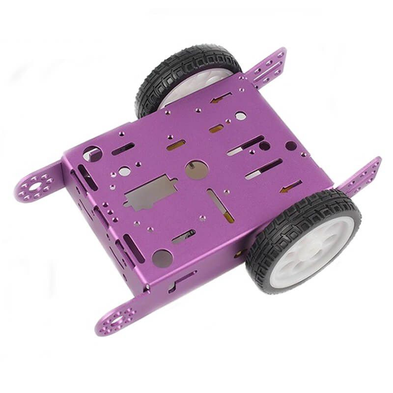
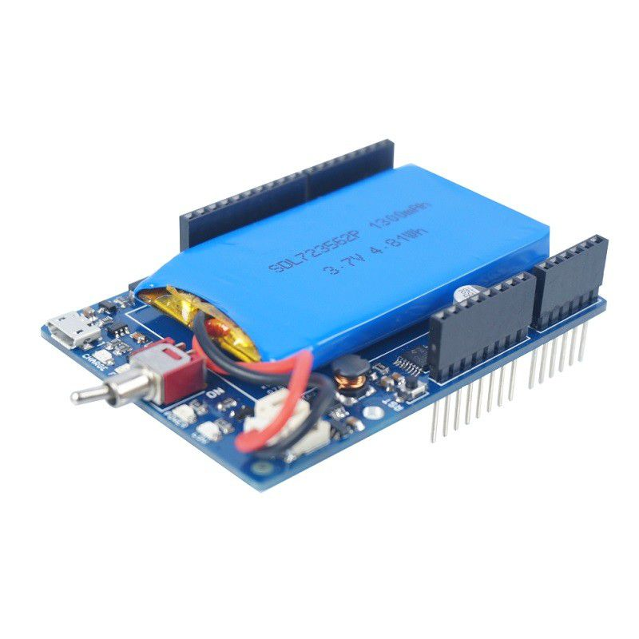

# XRobot

This demo project is for controlling RC Cars built with Arduino Board.

## Mobile
[XRobot Mobile] is a .NET MAUI application.





### Built with

This project utilizes the following packages:

1 - Plugin.BLE (for Bluetooth communication)

2 - ReactiveUI (for MVVM, realtime data)

3 - SkiaSharp (for creating custom controls)


## Microcontroller 

[ XRobot uController ] is an AVR assembly code (I also included a C language version) for controlling a robot car via Bluetooth (serial port communication) and reading an analog sensor.

**This code is written for ATmega328P uController only.**

These are a few useful links :

- [Atmega328P Datasheet](https://ww1.microchip.com/downloads/en/DeviceDoc/Atmel-7810-Automotive-Microcontrollers-ATmega328P_Datasheet.pdf)

- [Atmega328P Instruction Set](http://ww1.microchip.com/downloads/en/devicedoc/atmel-0856-avr-instruction-set-manual.pdf)

### Features

This project utilizes the following features:

1 - Universal Asynchronous Receiver Transmitter (UART)

2 - Pulse Width Modulation (PWM)

3 - Analogue to Digital Converter (ADC)


### Communication Protocol
XRobot uses serial communication to send packets and receive data from the RC robot.

* The validation uses a basic xor operation between packets to ensure the validity of the packet.

* Commands are used to specify to control the movement of the robot and reading from the robot.

* Data slots are used to carry additional information (e.g., direction and speed).




### Try it

#### Prerequisite

* You need Arduino installed in your machine (need `avrdude` for flashing).

* You need Powershell 6.1 at minimum installed.


#### Steps

1 - Clone the repo locally on your machine and open a Powershell window in the root folder.

2 - Copy the following commands and run in Powershell (press tab for autocomplete):

```Powershell

. .\run.ps1

Install-XRobot -Port COM3 -Upload

```

#### Componants

These are the components needed.
 
1- Ardunio Uno Board (or any board with Atmega328p).



2- Bluetooth Serial Transceiver HM-10



3- Cytron Shield L298P Motor Driver with GPIO.



4- Chassis with Two Motors



5- Power Source (for example. lipo-power-shield).




## Author 

Ayman Elfaki

## Copyright

This project is under the GPL-3.0 License.
